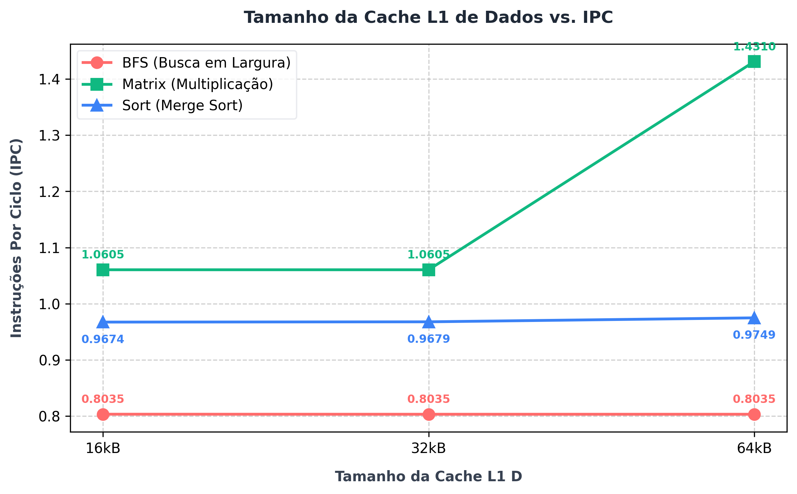
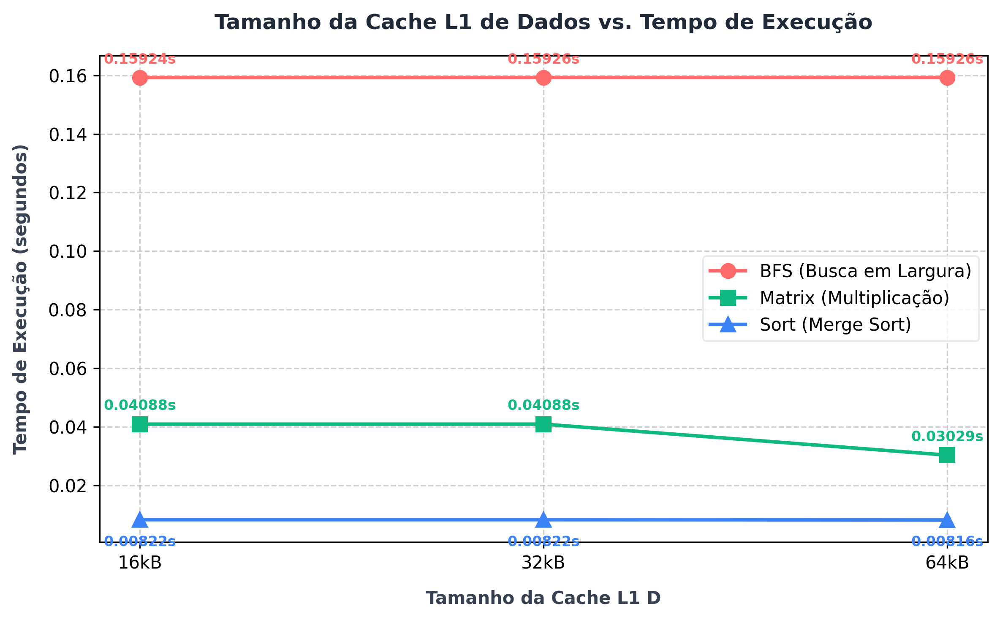
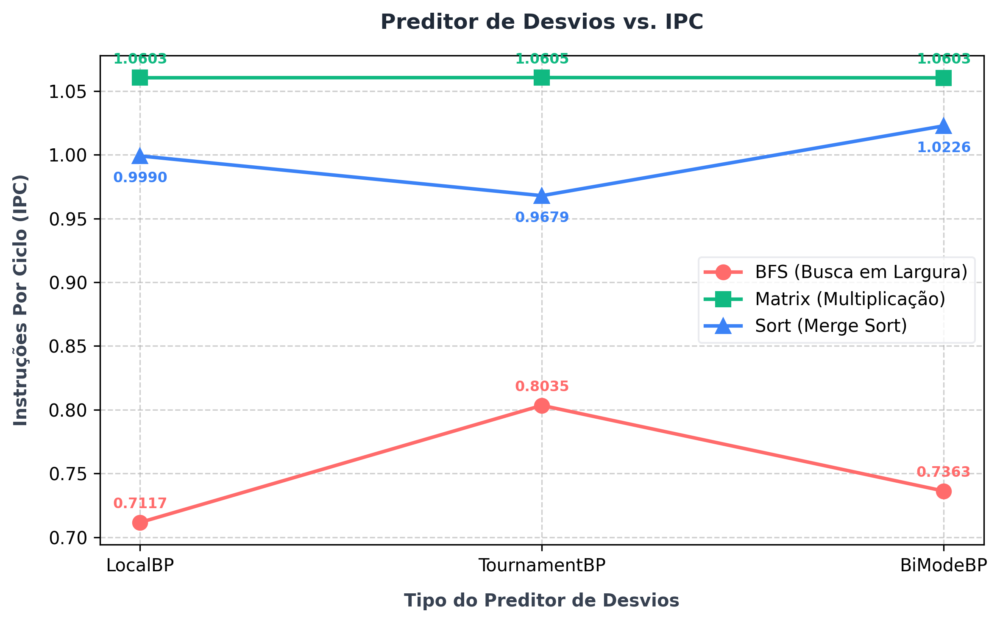
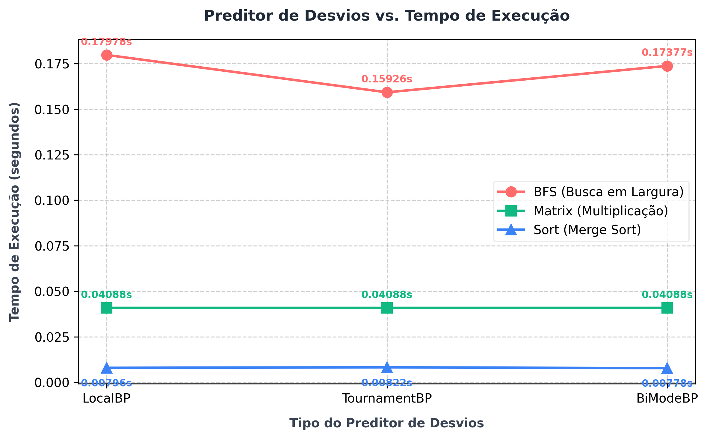
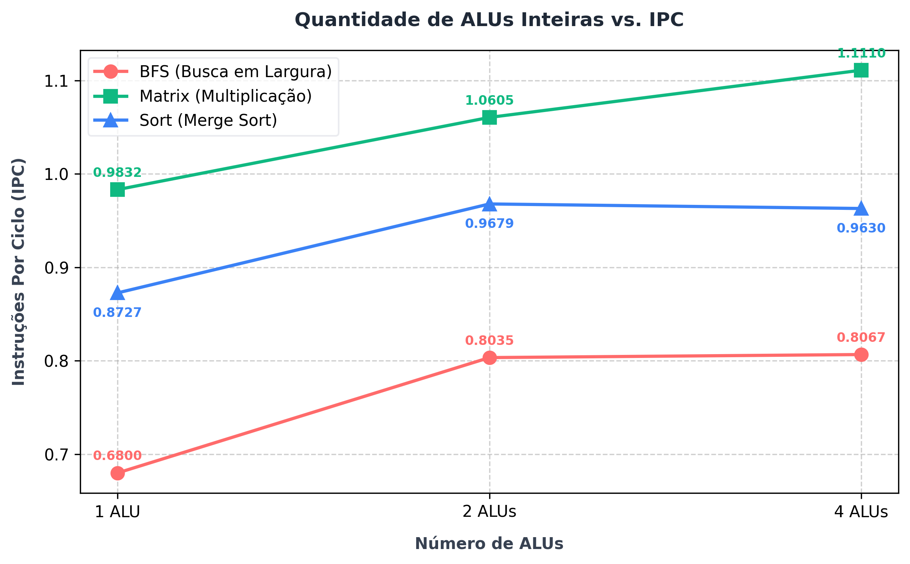
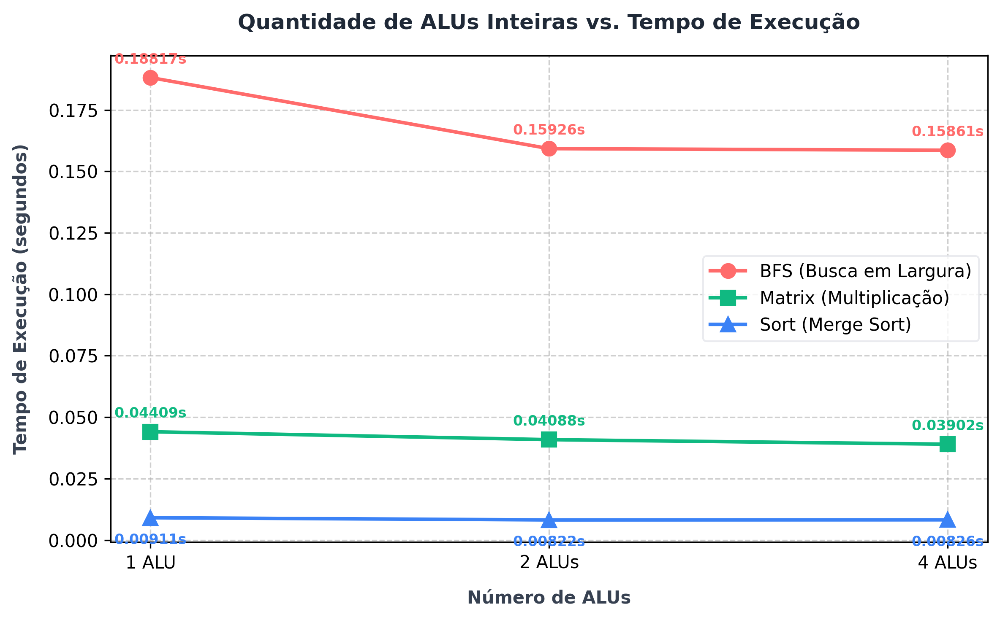

# Relatório de Análise de Desempenho — Trabalho Prático 2
**Disciplina:** INF01113 – Organização de Computadores B  
**Professor:** Antonio Carlos Schneider Beck Filho  

Este documento apresenta a análise completa das simulações de arquitetura realizadas utilizando o simulador **gem5** (modo Out-of-Order x86). O objetivo do trabalho consiste em analisar a sensibilidade de três aplicações com perfis distintos perante variações na organização do hardware (caches, preditor de desvios e unidades funcionais).

---

## 1. Descrição dos Benchmarks Utilizados

Para estressar diferentes componentes do processador e da hierarquia de memória, foram desenvolvidos três programas em C (compilados estaticamente):

1.  **Multiplicação de Matrizes ([matrix.c](c_programs/matrix.c)):**
    *   **Características:** Multiplicação clássica de matrizes $O(N^3)$ de tamanho $128 \times 128$. É uma aplicação computacionalmente intensa, caracterizada por alto uso de instruções aritméticas inteiras (ALU) e padrão de acesso à memória sequencial e previsível (alta localidade espacial).
2.  **Ordenação Merge Sort ([sort.c](c_programs/sort.c)):**
    *   **Características:** Ordenação de um vetor pseudo-aleatório de $20.000$ elementos. Apresenta alta densidade de desvios condicionais (*branches*) devido à lógica de intercalação e recursão, sendo ideal para avaliar o impacto do preditor de desvios e a penalidade de *squashing* no pipeline.
3.  **Busca em Largura - BFS ([bfs.c](c_programs/bfs.c)):**
    *   **Características:** Varredura em largura sobre uma matriz de adjacência representando um grafo de $2.000$ nós com conexões esparsas. Devido aos saltos na fila e indexação do grafo, gera um padrão de acessos não contíguos (aleatórios) à memória, estressando o subsistema de caches e TLB.

---

## 2. Configuração de Hardware Baseline (Configuração Fixa)

A arquitetura base (definida em [cpu_new.py](base_config/cpu_new.py) e [cache_new.py](base_config/cache_new.py)) foi otimizada a partir da configuração fornecida originalmente. As três alterações principais que definem a linha de base fixa foram:
*   **Aumento da largura do pipeline (Widths):** Modificada de 2 para **4** (fetch, decode, rename, dispatch, issue, writeback e commit). Permite despachar e retirar até 4 instruções por ciclo.
*   **Aumento do Reorder Buffer (ROB):** Expandido para **128 entradas** para suportar maior janela de execução fora de ordem.
*   **Aumento da Cache L2:** Configurada com capacidade de **512kB**.

Outros parâmetros mantidos fixos na base:
*   Cache L1 Instruções: 32kB, associatividade 4.
*   Cache L1 Dados: 32kB, associatividade 8.
*   Preditor de Desvios: `TournamentBP`.
*   Unidades Funcionais Inteiras: 2 ALUs (`MyIntALU` count = 2).

---

## 3. Tabela Geral de Resultados

Abaixo são consolidados os dados coletados de todas as simulações executadas na pasta [results/](results/):

| Rodada (Round) | Parâmetro Variado | Benchmark | Tempo de Simulação (`sim_seconds`) | IPC (`system.cpu.ipc`) | Ciclos de CPU (`numCycles`) |
| :--- | :--- | :--- | :---: | :---: | :---: |
| **Round 0** | **Baseline Fixa** | `bfs` | 0.159255 s | 0.803454 | 318.510.000 |
| | *(L1-D: 32kB, TournamentBP, 2 ALUs)* | `matrix` | 0.040877 s | 1.060484 | 81.754.682 |
| | | `sort` | 0.008216 s | 0.967881 | 16.432.000 |
| **Round 1** | **Tamanho Cache L1-D (16kB)** | `bfs` | 0.159237 s | 0.803543 | 318.474.000 |
| | | `matrix` | 0.040877 s | 1.060480 | 81.755.000 |
| | | `sort` | 0.008220 s | 0.967412 | 16.440.000 |
| | **Tamanho Cache L1-D (64kB)** | `bfs` | 0.159255 s | 0.803452 | 318.510.000 |
| | | `matrix` | 0.030294 s | **1.430989** | 60.587.000 |
| | | `sort` | 0.008156 s | 0.974945 | 16.312.000 |
| **Round 2** | **Preditor de Desvios (BiModeBP)** | `bfs` | 0.173771 s | 0.736336 | 347.542.000 |
| | | `matrix` | 0.040885 s | 1.060285 | 81.770.000 |
| | | `sort` | 0.007776 s | **1.022606** | 15.552.000 |
| | **Preditor de Desvios (LocalBP)** | `bfs` | 0.179784 s | 0.711707 | 359.568.000 |
| | | `matrix` | 0.040883 s | 1.060327 | 81.767.000 |
| | | `sort` | 0.007960 s | 0.999039 | 15.920.000 |
| **Round 3** | **Quantidade de ULA Int (1 ALU)** | `bfs` | 0.188167 s | 0.680003 | 376.334.000 |
| | | `matrix` | 0.044090 s | 0.983217 | 88.180.000 |
| | | `sort` | 0.009112 s | 0.872691 | 18.224.000 |
| | **Quantidade de ULA Int (4 ALUs)** | `bfs` | 0.158611 s | 0.806713 | 317.222.000 |
| | | `matrix` | 0.039019 s | **1.110999** | 78.038.000 |
| | | `sort` | 0.008258 s | 0.963001 | 16.516.000 |

---

## 4. Análise Crítica dos Resultados por Parâmetro

### 4.1. Tamanho da Cache L1 de Dados (Round 1)
*   **Comportamento:** 
    *   A **multiplicação de matrizes** apresentou a maior sensibilidade a essa mudança. Ao expandir a cache L1-D de 16kB/32kB para **64kB**, o tempo de execução caiu de **0.0408 s** para **0.0302 s** (~26% de aceleração), com o IPC disparando para **1.43**. Isso ocorre porque o conjunto de dados ativo (blocos das matrizes) passou a caber melhor na cache L1, reduzindo drasticamente os ciclos de espera (*stalls*) por misses.
    *   O benchmark **BFS** não apresentou nenhuma sensibilidade a este parâmetro (IPC estável em 0.80). Devido à natureza dispersa e grafos esparsos, os dados são acessados de forma aleatória, resultando em baixa localidade temporal. Aumentar a L1 apenas não é suficiente para mitigar esses misses.
    *   O **Merge Sort** mostrou um ganho marginal (IPC foi de 0.967 para 0.974), indicando que seu gargalo principal não reside na capacidade da L1 de dados sob o tamanho de vetor utilizado.
*   **Custo-Benefício:** Duplicar a cache L1 de dados para 64kB é altamente recomendado para aplicações com localidade espacial (como computação científica e álgebra linear), mas inócua para algoritmos em grafos.

#### Gráficos do Parâmetro 1: L1 Data Cache

---

### 4.2. Preditor de Desvios (Round 2)
*   **Comportamento:**
    *   Como esperado, o **Merge Sort** obteve o melhor benefício com as variações de branch predictor. O preditor baseline (`TournamentBP`) alcançou um IPC de 0.967. Ao usar o **`BiModeBP`**, o IPC subiu para **1.022** (redução do tempo de 0.0082s para 0.0077s). O `BiModeBP` lida melhor com branches que alternam fortemente de comportamento reduzindo o efeito de aliás prejudicial na tabela de histórico.
    *   No caso do **BFS**, o preditor baseline `TournamentBP` foi significativamente superior às alternativas. A troca por `BiModeBP` reduziu o IPC para 0.736 e por `LocalBP` reduziu para 0.711. Isso indica que a estrutura de desvios do BFS se beneficia de preditores globais ou híbridos com correlação de histórico de múltiplos branches.
    *   O `matrix` permaneceu inalterado (IPC ~1.06), dado que os branches de laço interno são altamente previsíveis.
*   **Custo-Benefício:** Substituir o preditor padrão por `BiModeBP` oferece excelente custo-benefício se o foco for em algoritmos de ordenação e busca intensivos em decisão, porém requer cautela visto que pode reduzir o desempenho de estruturas em grafo complexas como BFS.

#### Gráficos do Parâmetro 2: Branch Predictor

---

### 4.3. Quantidade de ULAs Inteiras (Round 3)
*   **Comportamento:**
    *   A redução para apenas **1 ALU** degradou severamente o desempenho de todos os programas. O IPC do `bfs` despencou para **0.680** (de 0.803) e do `matrix` caiu para **0.983** (de 1.060), evidenciando que uma única ALU se torna um gargalo estrutural crítico em pipelines largos (width=4).
    *   O aumento para **4 ALUs** beneficiou consideravelmente a multiplicação de matrizes, elevando o IPC para **1.11** e reduzindo o tempo para **0.039s**. Isto demonstra que a aplicação tem Paralelismo ao Nível de Instrução (ILP) suficiente para utilizar mais recursos de execução aritmética concorrentes.
    *   Para o `bfs` e `sort`, o aumento de 2 para 4 ALUs não trouxe benefícios significativos (o IPC do `sort` inclusive sofreu uma redução sutil de 0.967 para 0.963). Isso indica que essas aplicações são limitadas por dependências de dados sequenciais ou por latência de memória/branches, não conseguindo extrair vantagem de hardware de execução aritmética extra.
*   **Custo-Benefício:** Manter **2 ALUs** representa o melhor equilíbrio de custo-benefício. O salto para 4 ALUs consome área de silício e energia adicionais consideráveis para trazer benefício real restrito a aplicações puramente aritméticas.

#### Gráficos do Parâmetro 3: Unidades ULA

---

## 5. Conclusão e Diretrizes de Projeto
A partir do estudo de sensibilidade, as seguintes diretrizes são propostas para o design de um processador otimizado para o perfil de uso avaliado:
1.  **Priorize Cache L1 de 64kB** se o domínio da máquina virtual envolver processamento numérico denso (ex. simulações físicas ou redes neurais), uma vez que o impacto na multiplicação de matrizes é altíssimo.
2.  **Mantenha 2 ALUs** como padrão para uso geral, expandindo para 4 apenas se o foco for computação científica pura de ponto flutuante/inteiro.
3.  O preditor de desvios **TournamentBP** (baseline) demonstrou ser a opção mais robusta e equilibrada, pois manteve alto desempenho no BFS e desempenho aceitável no Merge Sort, enquanto o `BiModeBP`, apesar de ótimo para ordenação, prejudicou o BFS.
